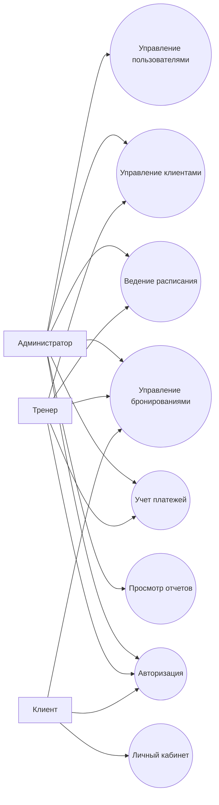
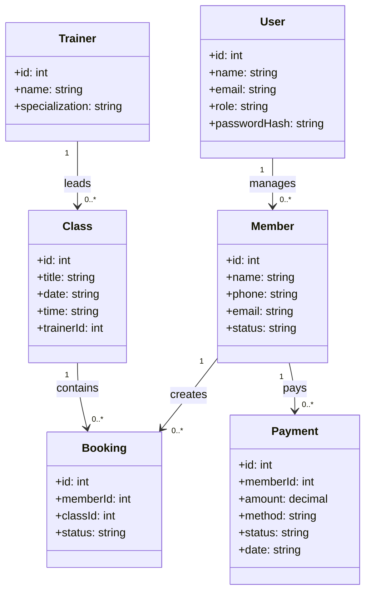
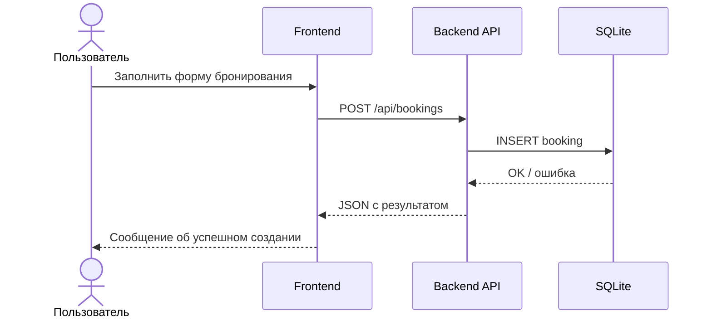
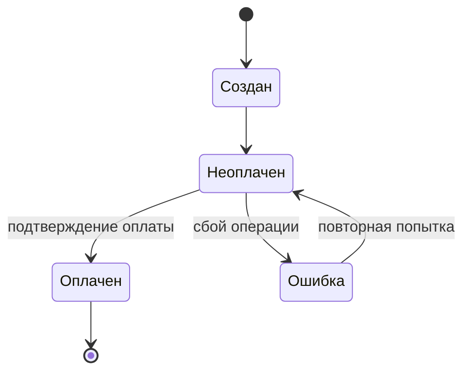

# UML-диаграммы

## 1 Диаграмма вариантов использования (Use Case)

## 2 Диаграмма классов (логическая модель)

## 3 Диаграмма последовательности (создание бронирования)

## 4 Диаграмма состояний (сущность «Платеж»)

## Примечание

Для печатной версии рекомендуется перерисовать диаграммы в UML-редакторе (StarUML, draw.io, PlantUML) с подписями рисунков и нумерацией по требованиям кафедры.
