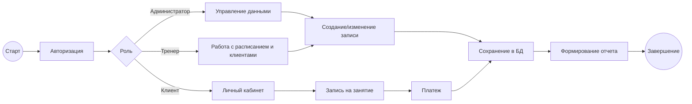

# Функциональные модели IDEF0 / IDEF3 / BPMN

## 1 Контекстная модель IDEF0 (A-0)

### Функция
A-0: «Управление процессами спортивного комплекса».

### ICOM-структура

- Inputs: данные клиентов, заявки на запись, платежные данные.
- Controls: регламенты клуба, роли доступа, расписание, тарифы.
- Outputs: записи в БД, отчеты, подтвержденные бронирования, статусы оплат.
- Mechanisms: frontend (React), backend (Rust/Axum), SQLite, администратор/тренер.

## 2 Декомпозиция IDEF0 (A0)

A1 — Управление пользователями и ролями.
A2 — Управление клиентами.
A3 — Управление расписанием и занятиями.
A4 — Управление бронированиями.
A5 — Управление платежами и отчетностью.

## 3 Процессная модель IDEF3 (сценарий обслуживания клиента)

1. Авторизация сотрудника.
2. Поиск или создание клиента.
3. Выбор занятия.
4. Создание бронирования.
5. Фиксация оплаты.
6. Формирование отчета.

## 4 BPMN-представление (упрощенно)

## Примечание

Для сдачи в печатном виде рекомендуется финальная отрисовка IDEF0/IDEF3/BPMN в draw.io, Bizagi Modeler или аналогичном инструменте с подписями и нумерацией рисунков.
