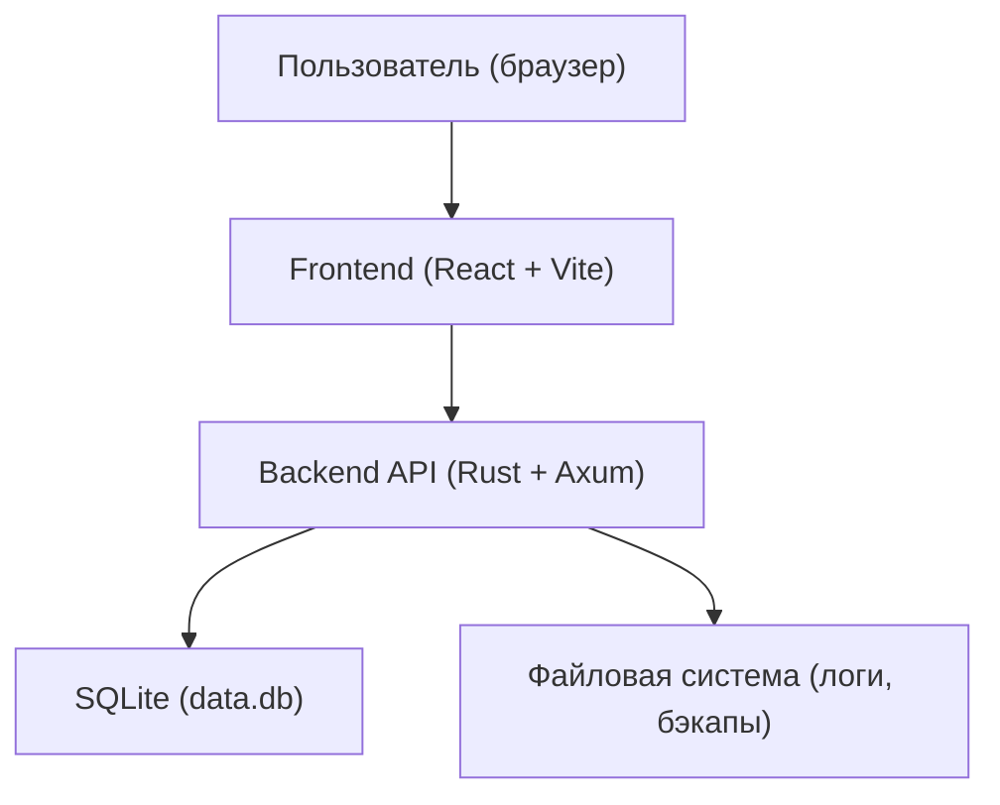
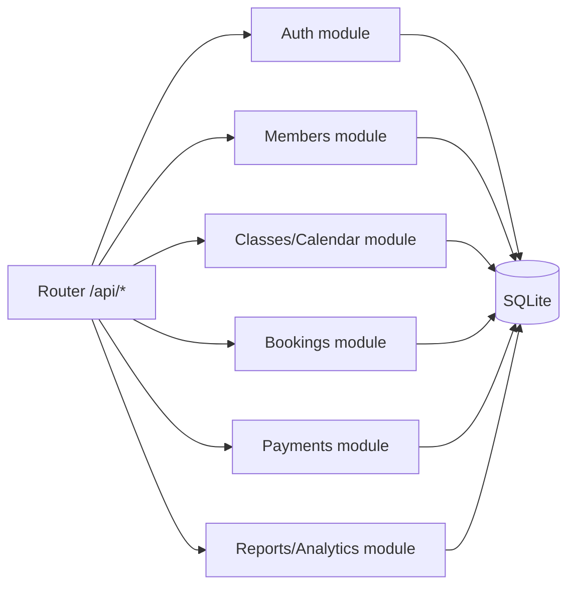
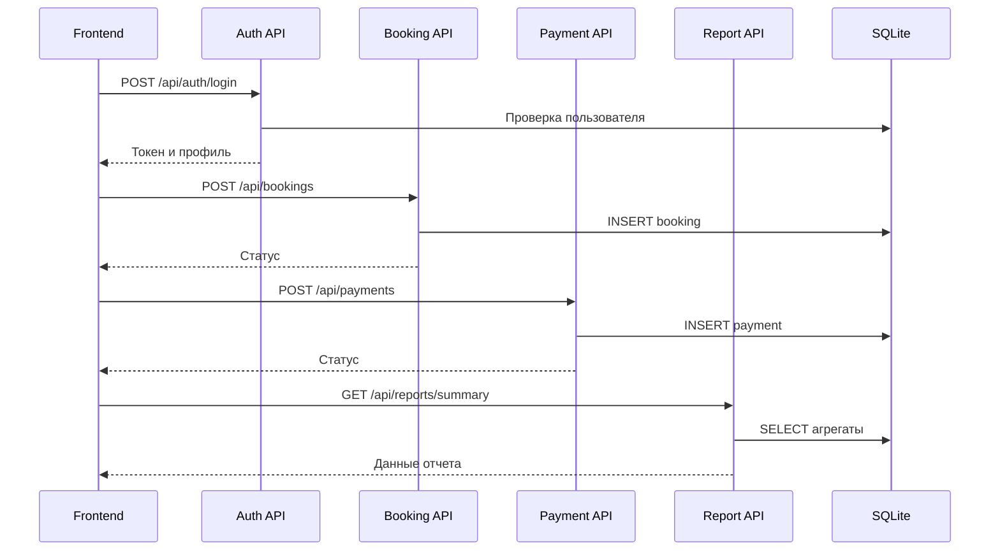

# Диаграмма архитектуры и взаимодействия модулей

## 1 Архитектура программного комплекса

## 2 Внутренняя модульная структура backend

## 3 Диаграмма взаимодействия модулей (пример сценария)

## 4 Вывод

Архитектура построена по принципу разделения ответственности: интерфейс, бизнес-логика и хранилище данных изолированы, что упрощает сопровождение и расширение системы.
