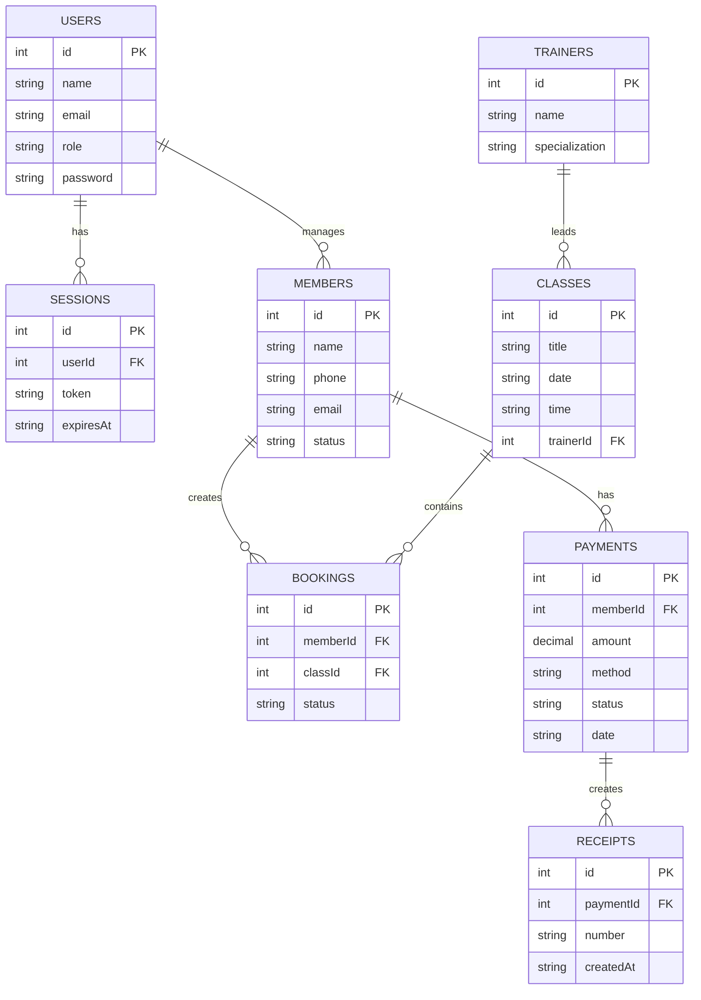

# ER-модель и схема данных

## 1 Сущности

1. `users`
2. `sessions`
3. `members`
4. `trainers`
5. `classes`
6. `bookings`
7. `payments`
8. `receipts`

## 2 ER-диаграмма (концептуальная)

## 3 Ограничения целостности

1. Первичные ключи задаются во всех таблицах.
2. Внешние ключи обеспечивают согласованность связей.
3. Обязательные поля (NOT NULL) используются для критичных атрибутов.
4. Значения статусов ограничиваются допустимыми бизнес-правилами.

## 4 SQL-часть

Фактические SQL-объекты формируются в backend при инициализации БД (`backend/src/main.rs`) и хранятся в локальном файле `backend/data.db`.
