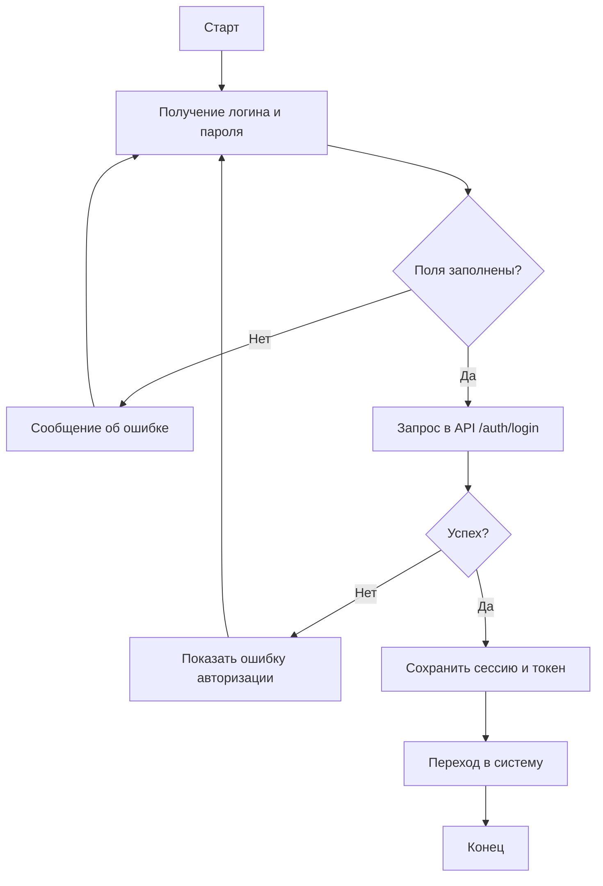
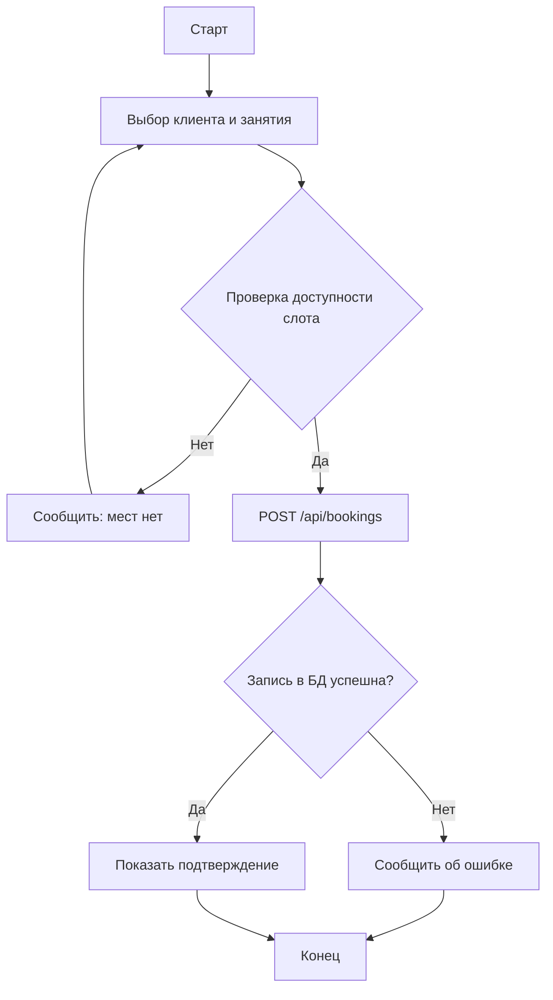
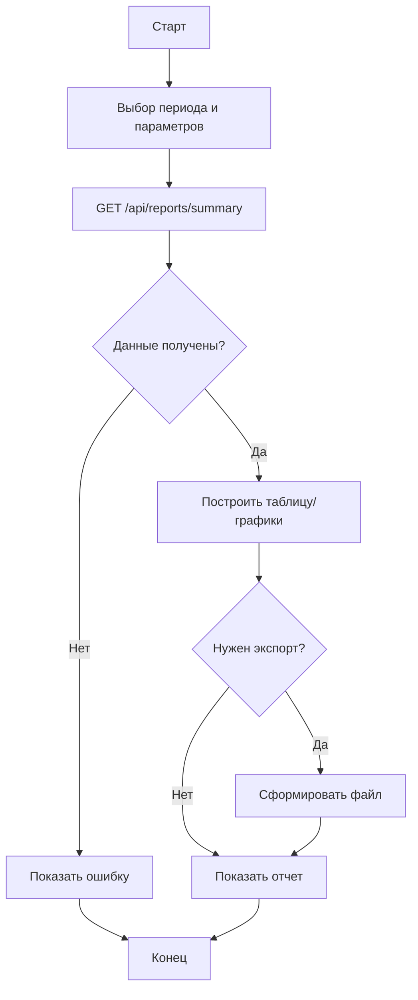

# Блок-схемы алгоритмов

## 1 Алгоритм авторизации пользователя

```mermaid
flowchart TD
    A[Старт] --> B[Получение логина и пароля]
    B --> C{Поля заполнены?}
    C -->|Нет| D[Сообщение об ошибке] --> B
    C -->|Да| E[Запрос в API /auth/login]
    E --> F{Успех?}
    F -->|Нет| G[Показать ошибку авторизации] --> B
    F -->|Да| H[Сохранить сессию и токен]
    H --> I[Переход в систему]
    I --> J[Конец]
```

## 2 Алгоритм создания бронирования

```mermaid
flowchart TD
    A[Старт] --> B[Выбор клиента и занятия]
    B --> C{Проверка доступности слота}
    C -->|Нет| D[Сообщить: мест нет] --> B
    C -->|Да| E[POST /api/bookings]
    E --> F{Запись в БД успешна?}
    F -->|Нет| G[Сообщить об ошибке]
    F -->|Да| H[Показать подтверждение]
    G --> I[Конец]
    H --> I
```

## 3 Алгоритм формирования отчета

```mermaid
flowchart TD
    A[Старт] --> B[Выбор периода и параметров]
    B --> C[GET /api/reports/summary]
    C --> D{Данные получены?}
    D -->|Нет| E[Показать ошибку]
    D -->|Да| F[Построить таблицу/графики]
    F --> G{Нужен экспорт?}
    G -->|Да| H[Сформировать файл]
    G -->|Нет| I[Показать отчет]
    H --> I
    E --> J[Конец]
    I --> J
```
